# Seedance Cinemanga Director

[](https://github.com/juebai-aigc/Seedance-cinemanga-director/actions/workflows/validate.yml)

<p align="center">
  <strong>面向即梦 Seedance 的双影视级视频导演 Skill</strong><br>
  3D国漫影视级 · 真人影视级 · 完整15秒 · 连续4–15秒 · 强连续性
</p>

<p align="center">
  
</p>

> [!IMPORTANT]
> **非官方声明：**本项目为社区开源项目，与即梦或 Seedance 官方无隶属、授权、背书或合作关系。项目名称仅用于说明其面向的创作工作流与兼容目标。

## 项目简介

`Seedance Cinemanga Director` 将中文小说、剧本、剧情段落、分镜笔记和参考图描述，转换为可直接用于即梦 Seedance 的导演级视频提示词。

它不是普通的“提示词润色器”，而是一套先分析剧情、再以每条4–15秒视频为单位，按时长、节拍和复杂度灵活选择标准故事板、九宫格、二十五宫格或智能宫格，并生成 Seedance 2.0 可准确参考的详细分镜图的导演工作流；同时包含角色多视角设计、镜头合约、人物过滤、角色外貌差异化、对白时长、表演调度、空间连续、道具追踪、光影锁定和尾帧接力能力。

## 视觉预览

这批视觉资产已按用途归档到 `assets/`，并放置在仓库文档中的合适位置，分别承担 **主视觉装饰、架构展示、板式示例、文档资产示例** 四类作用。

<p align="center">
  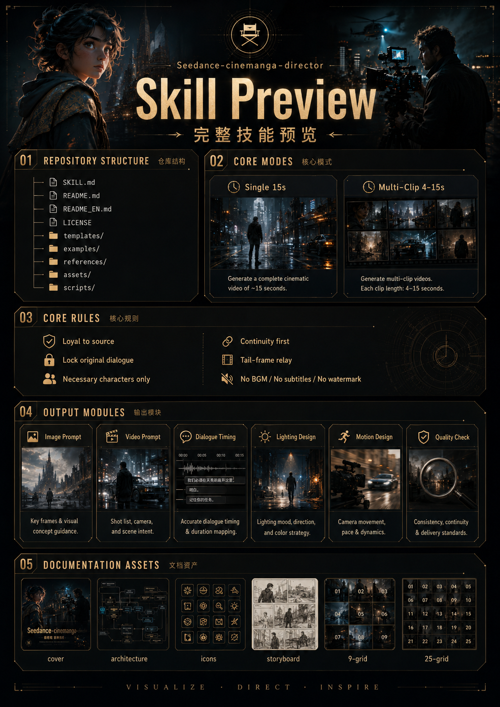
</p>

> 视觉图为功能与结构的概念预览；图内旧文件名、固定时间段与示例参数不构成当前规范，以文字文档和本文“仓库结构”为准。

## 核心能力

- **双影视引擎**：精致3D国漫影视级 / 真人影视级；
- **双输出模式**：完整15秒单条 / 连续多条4–15秒；
- **原台词锁定**：不改写、不删减、不重排；
- **必要人物过滤**：只保留当前剧情真正需要的角色；
- **剧情分析优先**：先拆解剧情事实、台词、人物、节拍和时间预算；
- **4–15秒自适应分镜**：每条视频分别按总时长、剧情节拍、镜头/关键状态数量和复杂度选择标准故事板、九宫格、二十五宫格或智能宫格，不按秒数机械绑定、不为凑格数改变剧情；
- **逐镜时间分镜图**：每张执行板只服务一个视频条目，页头标4–15秒总时长与15秒上限；每格标阅读顺序、镜头序号、起止时间、单镜时长，以及 Seedance 2.0 执行所需的角色、动作、声音、光影与连续性信息；
- **角色—分镜—API可追溯绑定**：每个USE镜头关联永久角色ID和独立角色板，每张执行分镜页绑定唯一VID；执行素材清单、视频提示词图片编号与API content严格同序；
- **镜头使用清单**：用USE、REFERENCE-ONLY、SKIP明确哪些镜头必须生成、仅作参考或不得提交生成端；
- **AI可辨识运镜路线**：用分段节点、逐段箭头、转向后方向、速度、机位高度及俯视/侧视小图描述完整路径；
- **独立角色多视角设计**：每名必要角色单独输出一张角色板，至少包含正面、左侧面、右侧面和背面；
- **角色身份注册**：使用永久CHAR-ID、独立参考图编号和适用镜头贯通分镜、提示词与API素材顺序；
- **人物外貌差异化**：同剧本不同角色禁止相同或高度相似的模板脸，双胞胎等明确剧情需要除外；
- **导演级镜头语言**：景别、机位、轴线、焦点、运镜、结束构图；
- **表演与走位**：站位、面对关系、动作顺序、视线和手部状态；
- **对白时长校验**：为口型、停顿、反应和尾帧保留真实时间；
- **强连续性**：角色、空间、道具、光影、屏幕方向稳定；
- **转场感知接力**：连续接力严格继承；同场切镜允许摄影机变化；换场/时间跳跃建立新账本；匹配剪辑与声音桥保留指定锚点；
- **声音叙事**：环境音、动作音、呼吸、空间声源和静默；
- **默认纯净输出**：有音效，无音乐、无BGM、无字幕、无水印。
- **状态账本**：逐镜追踪角色身份、服装层、伤势污损、左右手、道具、空间锚点、主光和天气；
- **3D制作约束**：控制材质响应、动作力学、接触、次级运动、虚拟摄影机和渲染稳定性；
- **真人摄影约束**：明确焦段、机位、设备、景深、曝光、光源、演员微表演和现场物理；
- **提示词编译器**：按优先级解决冲突，控制单镜复杂度，删除不会改变画面的空泛画质词。
- **执行素材过滤**：每条视频只提交当前USE镜头需要的独立角色板、分镜页、场景板和尾帧，排除SKIP与装饰图。
- **按需导演知识库**：内置23份分镜、运镜、构图、剪辑、光影、调度、景深、13字段大表、高难度镜头、一镜到底和平台参考资料，先完成剧情分析，再按镜头问题精确调用，不让案例或旧参数覆盖核心规则。

## 快速安装

### Codex 手动安装

将仓库克隆或复制到 `$CODEX_HOME/skills/seedance-cinemanga-director`；未设置 `CODEX_HOME` 时使用 `~/.codex/skills/seedance-cinemanga-director`。重新打开 Codex 后即可发现该 Skill。

### OpenClaw / AgentSkills Git 安装

```bash
openclaw skills install git:juebai-aigc/Seedance-cinemanga-director@main
```

此命令需要本机已安装兼容的 OpenClaw CLI；本仓库的本地校验不验证第三方 CLI 的安装与网络行为。

### 本地目录安装

```bash
git clone https://github.com/juebai-aigc/Seedance-cinemanga-director.git
openclaw skills install ./Seedance-cinemanga-director
```

也可以把整个目录放入以下任一 Skill 路径：

```text
<workspace>/skills/seedance-cinemanga-director
<workspace>/.agents/skills/seedance-cinemanga-director
~/.agents/skills/seedance-cinemanga-director
~/.openclaw/skills/seedance-cinemanga-director
```

## 接入 Seedance API 后直接运行

本仓库现在同时包含导演 Skill 与平台无关的 API 执行适配器。Codex、OpenClaw 或其他能够读取 AgentSkills 并执行 Python 的 AI，只需加载本仓库、配置火山方舟凭证，即可完成“素材分析 → 3D/真人专项导演编译 → 请求预检 → 异步生成 → 下载结果”的流程。

```powershell
Copy-Item .env.example .env
python scripts/seedance_client.py --model doubao-seedance-2-0-260128 create --prompt-file examples/api-prompt.txt --dry-run
```

确认模型权限和请求体后，实际创建任务并下载：

```bash
python scripts/seedance_client.py create --prompt-file prompt.txt --wait --output outputs/seedance.mp4
```

如果创建响应在返回任务ID前断开，先用列表恢复可能已经接收的任务，避免重复计费：

```bash
python scripts/seedance_client.py list --status running --filter-model ep-你的推理接入点ID
```

创建视频可能产生费用，因此 Skill 必须先 dry-run，且只有用户明确要求实际生成时才调用创建接口。完整配置与命令见 [API 接入文档](docs/api-integration.md)，Codex / OpenClaw / 其他代理的接入方式见 [Agent 接入文档](docs/agent-integration.md)。

参考图既可使用 API 可访问的 HTTPS URL，也可使用账户中已授权可信人物素材的 `asset://asset-id`；只有本机环回测试允许 HTTP。执行客户端会按 Seedance 2.0 契约写入 `role: reference_image`。首尾帧、视频、音频等其他模态继续通过官方 `content` JSON 透传。

## 使用示例

### 完整15秒单条

```text
使用 Seedance Cinemanga Director，把下面剧情制作成完整15秒单条即梦视频。
风格：精致3D国漫影视级。
要求：保留原台词，有音效，无BGM，无字幕。

[粘贴剧情]
```

### 连续多条

```text
使用 Seedance Cinemanga Director，把下面剧本拆成连续多条4–15秒视频。
风格：真人影视级。
所有人物、服装、场景、道具和光影必须连贯，上一条尾帧接下一条开头。

[粘贴剧本]
```

### 参考图锁定

```text
图一是角色A，图二是角色B，图三是固定场景。
按照图片锁定角色脸型、发型、服装和场景结构，生成完整15秒单条视频。
```

## 系统架构总览

下图用于说明这个 Skill 从输入素材到最终导演级提示词的完整路径，适合放在仓库说明和 `docs/architecture.md` 中作为核心架构图。

<p align="center">
  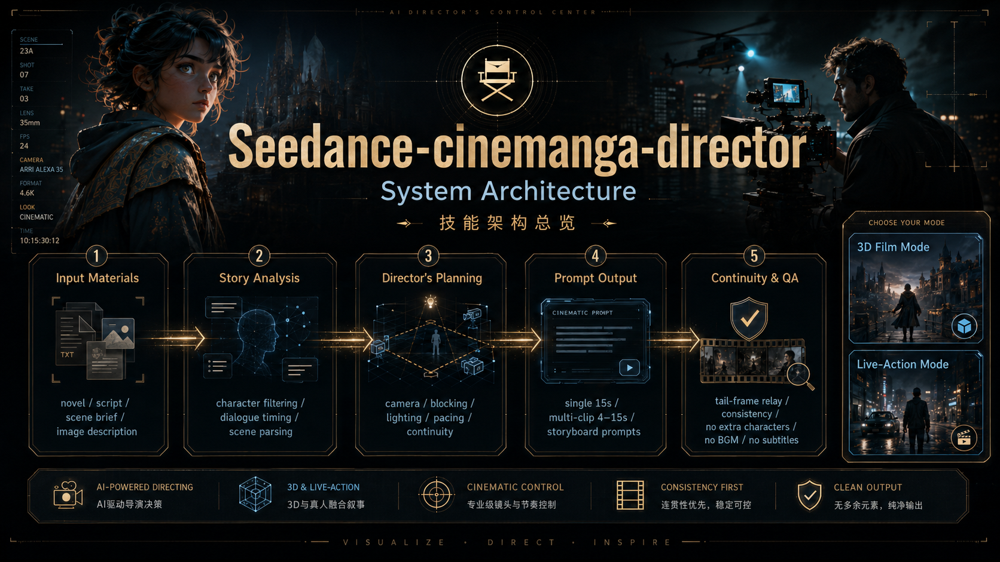
</p>

对应流程：

1. **Input Materials**：小说、剧本、场景简介、图片描述等输入；
2. **Story Analysis**：人物筛选、对白时长、剧情拆解；
3. **Director's Planning**：机位、走位、光影、节奏与连续性设计；
4. **Prompt Output**：完整15秒 / 连续多条4–15秒 / 分镜提示词；
5. **Continuity & QA**：尾帧接力、连戏校验、无BGM、无字幕等清洁输出约束。

| 导演工作流详图 | 提示词输出系统 | 视觉资产与质检 |
|---|---|---|
| 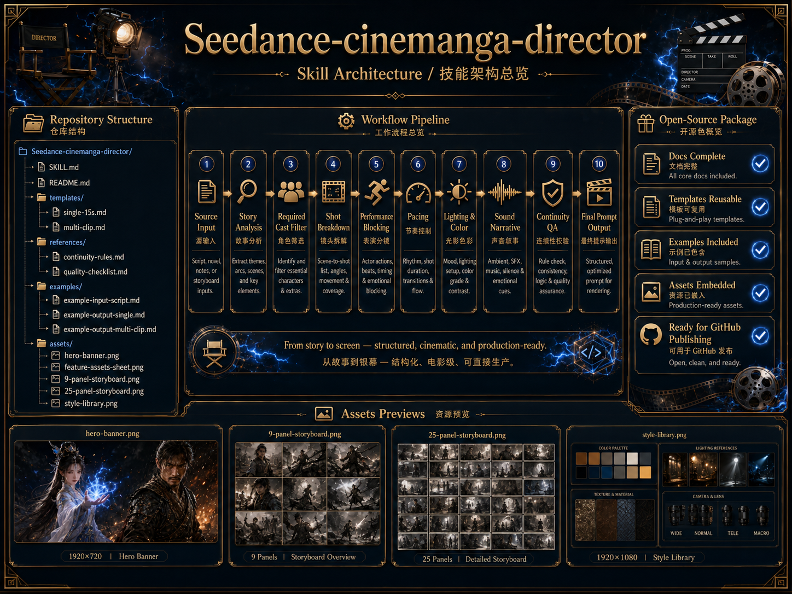 | 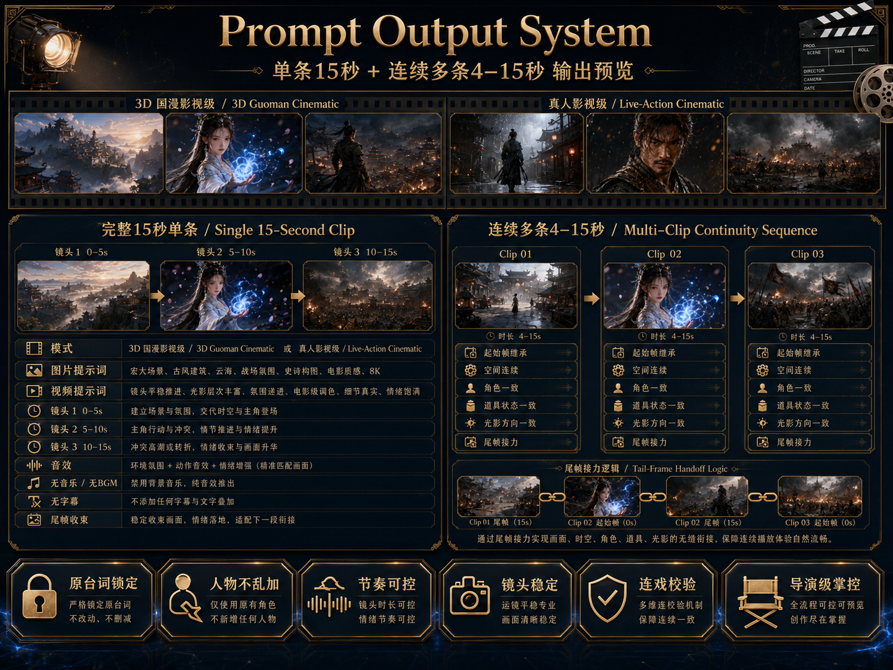 | 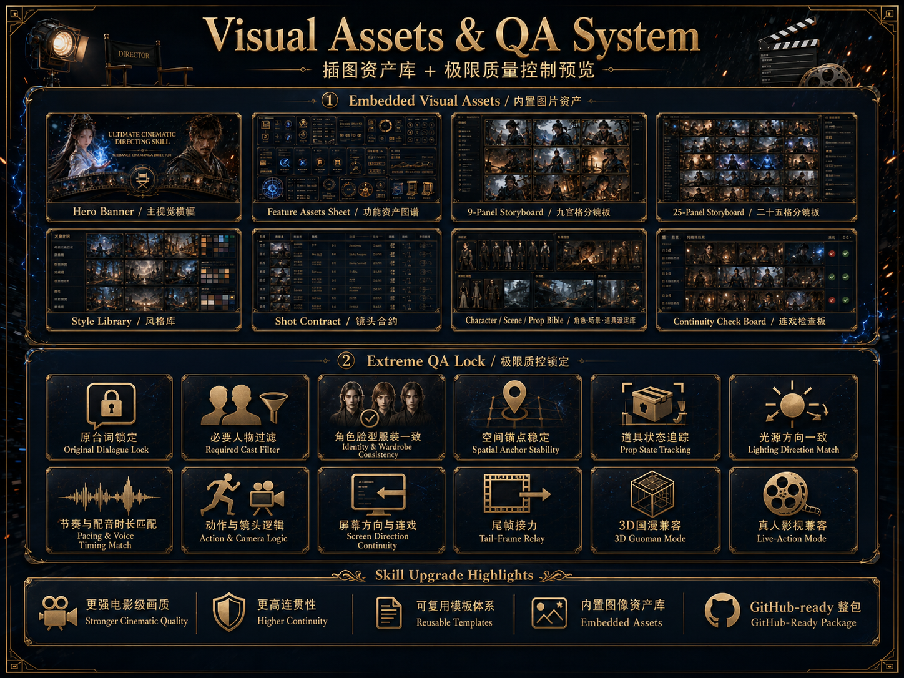 |

## 按需知识库与 Seedance 素材绑定

知识库只在剧情分析和分镜形式决策之后，按当前镜头问题加载必要资料；平台案例、词典和旧参数不会覆盖核心规则。新增的13字段大表只扩展交付，高难度镜头与一镜到底必须先通过可执行性闸门，并区分真一镜到底与带隐藏接缝的伪一镜到底。

<p align="center">
  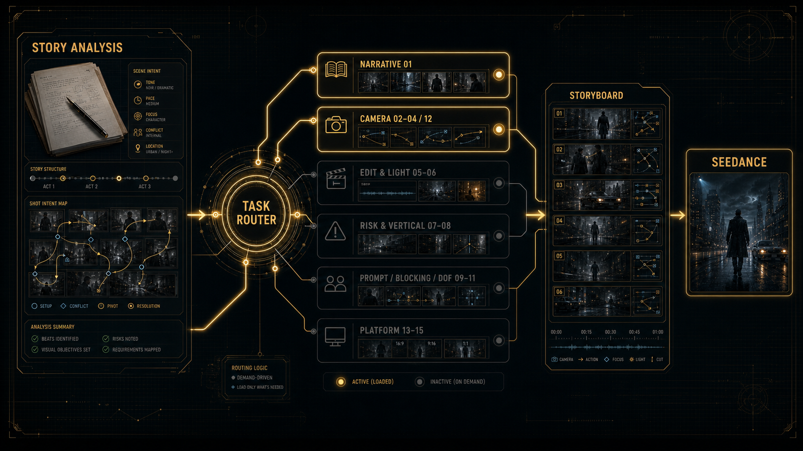
</p>

进入 Seedance 2.0 执行时，每名角色继续使用独立角色板，并按执行素材清单绑定场景、分镜页、可选运镜参考与音频参考。`SKIP` 与装饰图不提交生成端。

<p align="center">
  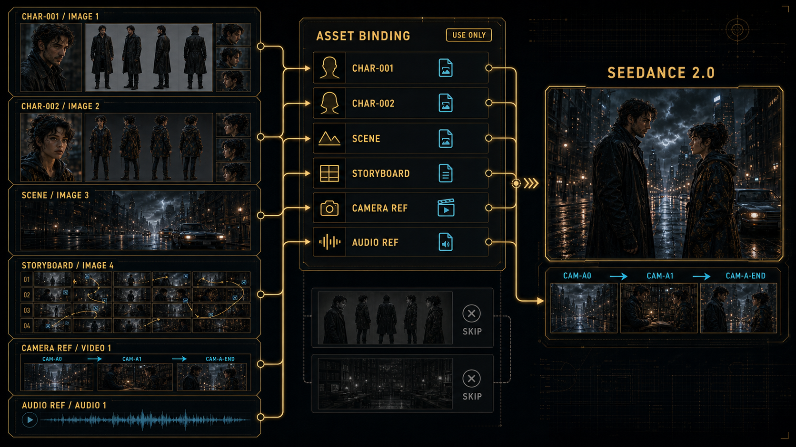
</p>

## 分镜板示例资源

这几张图更适合放在 **示例展示区**，用来说明本 Skill 适配的分镜板类型与视觉组织方式：

| 六镜分镜执行板 | 九宫格示例 | 二十五格示例 |
|---|---|---|
| 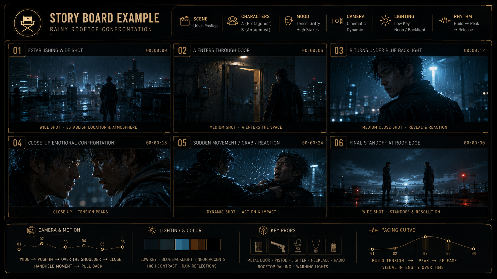 | 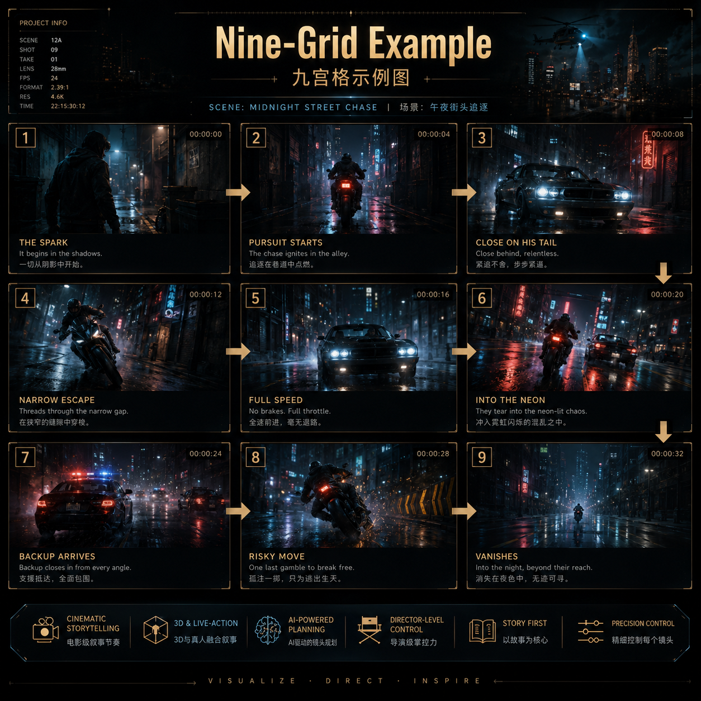 | 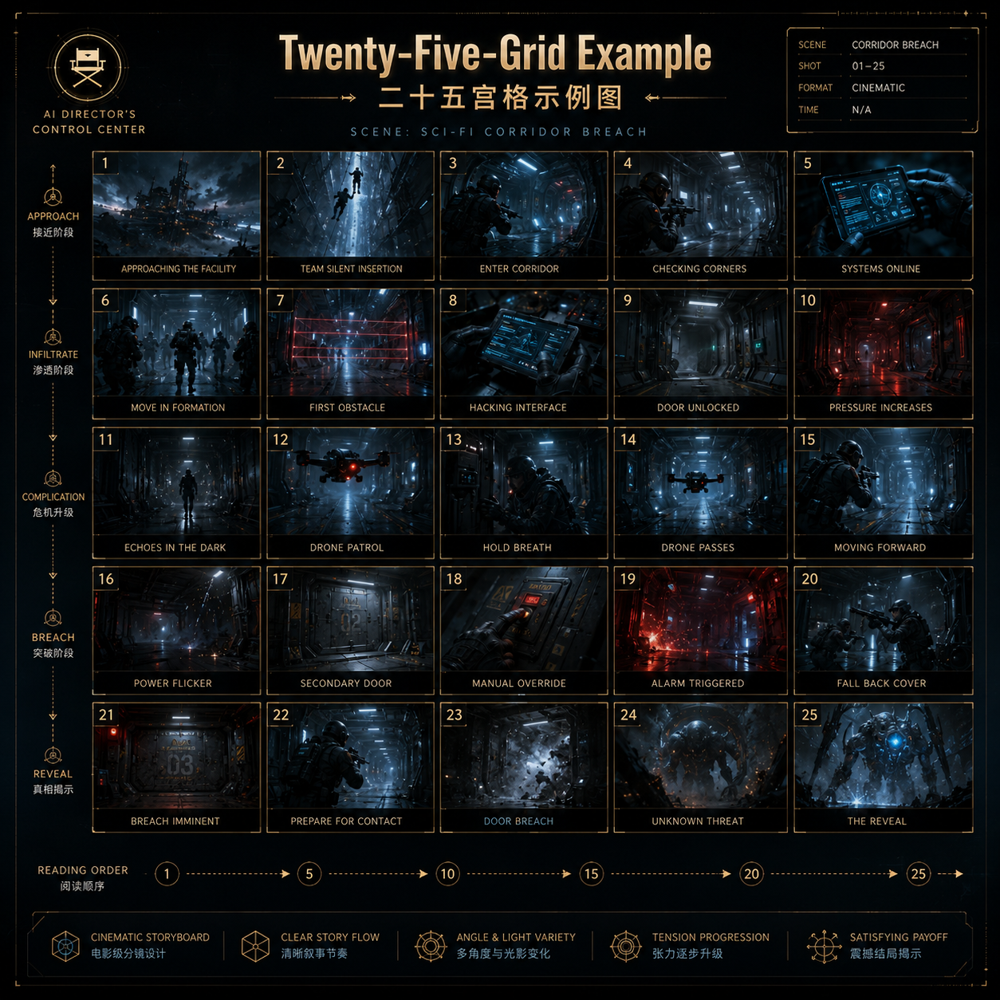 |

建议用途：

- `storyboard-example.png`：说明标准执行板、镜头分栏、节奏曲线、灯光与关键道具字段；
- `nine-grid-example.png`：说明九宫格阅读顺序、箭头衔接与节奏推进；
- `twenty-five-grid-example.png`：说明长段落、多镜头和复杂节奏的连续铺排。

### 新增工作流与识别规范图

| 自适应分镜工作流 | 独立角色差异化设计 | AI可辨识运镜路线 |
|---|---|---|
| 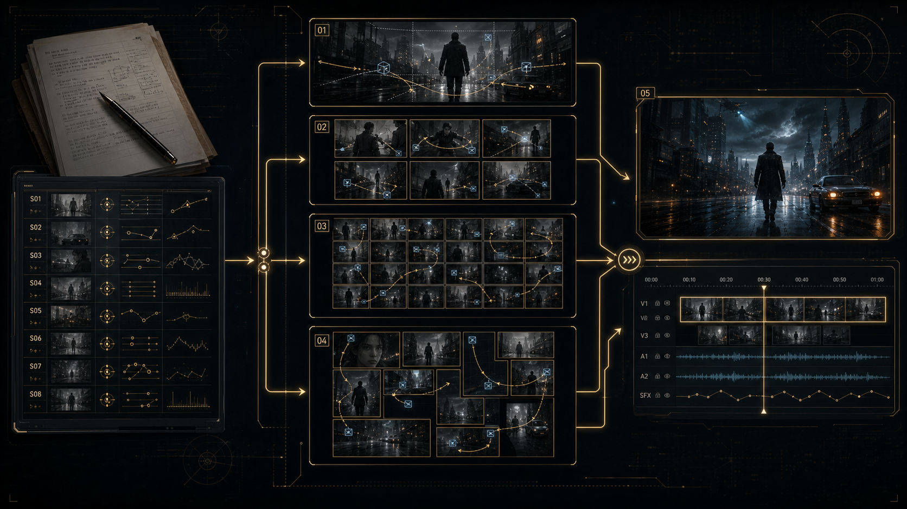 | 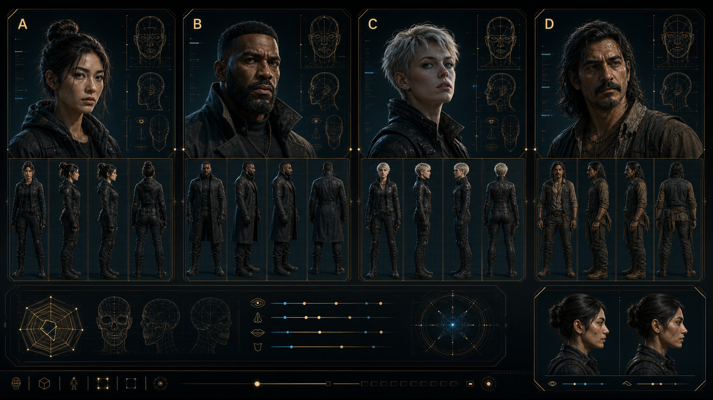 | 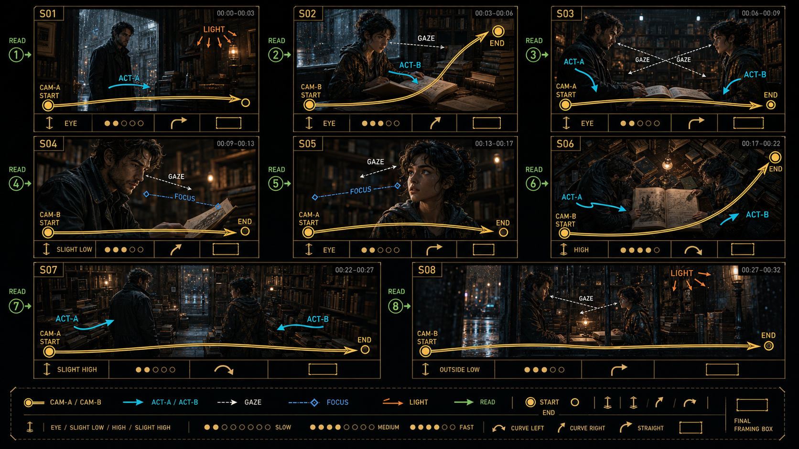 |

<p align="center">
  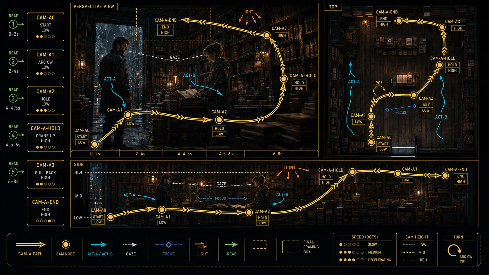
</p>

- `adaptive-storyboard-workflow.png`：展示剧情分析如何按需要分流到标准故事板、九宫格、二十五宫格或智能宫格；
- `character-differentiation-board.png`：用于文档说明不同角色的结构性面部差异；它是装饰性对比图，运行时仍要求每个角色使用单独角色板；
- `ai-readable-camera-routes.png`：展示CAM、ACT、GAZE、FOCUS、LIGHT和READ路线代码、箭头及图例。
- `segmented-camera-path.png`：展示多段运镜的连续节点、转向后的后续箭头、速度、机位高度以及同步俯视/侧视路线。

## 文档资产与装饰图标

下图适合作为 README 和文档页中的“资产板 / 装饰图标板”，帮助用户快速理解功能模块。

<p align="center">
  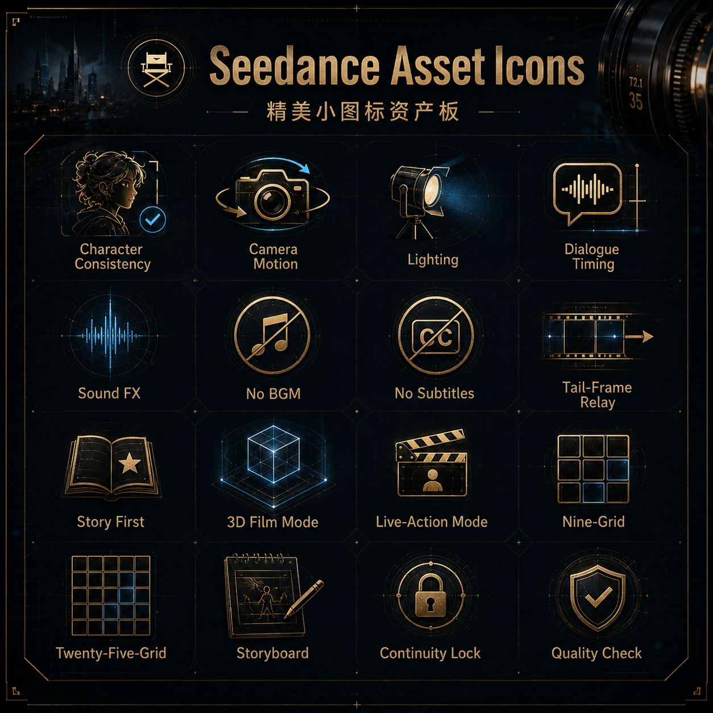
</p>

这张图把仓库中最重要的视觉语义统一为 16 个小图标模块，例如：

- Character Consistency
- Camera Motion
- Lighting
- Dialogue Timing
- Sound FX
- No BGM / No Subtitles
- Tail-Frame Relay
- 3D Film Mode / Live-Action Mode
- Nine-Grid / Twenty-Five-Grid
- Storyboard / Continuity Lock / Quality Check

## 仓库结构

```text
Seedance-cinemanga-director/
├── SKILL.md
├── agents/
│   └── openai.yaml
├── README.md
├── CHANGELOG.md
├── CONTRIBUTING.md
├── NOTICE
├── LICENSE
├── .github/
│   ├── workflows/
│   │   ├── bandit.yml
│   │   ├── codeql.yml
│   │   └── validate.yml
│   ├── pull_request_template.md
│   └── ISSUE_TEMPLATE/
├── assets/
│   ├── README.md
│   ├── cover-banner.png
│   ├── feature-overview.png
│   ├── skill-preview.png
│   ├── system-architecture.png
│   ├── workflow-architecture.png
│   ├── prompt-output-system.png
│   ├── visual-assets-qa.png
│   ├── adaptive-storyboard-workflow.png
│   ├── character-differentiation-board.png
│   ├── ai-readable-camera-routes.png
│   ├── segmented-camera-path.png
│   ├── knowledge-routing-map.png
│   ├── seedance-multimodal-binding.png
│   ├── icons-board.png
│   ├── storyboard-example.png
│   ├── nine-grid-example.png
│   └── twenty-five-grid-example.png
├── docs/
│   ├── architecture.md
│   ├── agent-integration.md
│   ├── api-integration.md
│   ├── installation.md
│   └── visual-showcase.md
├── templates/
│   ├── single-15s.md
│   ├── multi-clip.md
│   └── storyboard-board.md
├── references/
│   ├── continuity-rules.md
│   ├── character-design.md
│   ├── storyboard-design.md
│   ├── quality-checklist.md
│   ├── style-modes.md
│   ├── dialogue-timing.md
│   ├── shot-language.md
│   ├── 3d-cinematic-production.md
│   ├── live-action-cinematography.md
│   ├── runtime-orchestration.md
│   ├── seedance-api.md
│   ├── prompt-compiler.md
│   ├── knowledge-00-index.md
│   └── knowledge-01...22（按需导演参考知识库）
├── examples/
│   ├── api-prompt.txt
│   ├── example-input-script.md
│   ├── example-output-single.md
│   └── example-output-multi-clip.md
├── scripts/
│   ├── seedance_client.py
│   └── validate_skill.py
└── tests/
    ├── acceptance-cases.md
    └── test_seedance_client.py
```

## 输出约束

输出依次包含剧情分析、分镜形式决策、独立角色板与身份注册表、详细分镜图、导演方案和可复制提示词。完整15秒模式保留以下边界标记：

```text
_::~OUTPUT_START::~_
剧情分析与分镜形式决策
独立角色板、角色身份注册表与详细分镜图
导演方案（不粘贴）
可复制图片提示词
===
可复制视频提示词
_::~OUTPUT_END::~_
```

连续多条模式中，每条先声明转场类型，再按连续接力、同场切镜、换场/时间跳跃或匹配剪辑/声音桥分别记录继承状态、允许变化和保留锚点。

## 本地校验

```bash
python scripts/validate_skill.py
```

校验器会检查核心文件、YAML Frontmatter、Skill 名称、模板标记、关键规则、API 执行契约和文档链接是否存在。

GitHub Actions 会在每次推送到 `main`、Pull Request 和手动触发时，使用 Python 3.10 与 3.13 自动运行编译检查、离线单元测试、API dry-run 和完整校验。CI 不会创建视频任务。

## 视觉资产放置策略

本次新增图片已按“**装饰优先级 + 示例优先级**”分配到仓库文档中：

- **封面主视觉**：`assets/cover-banner.png`
- **完整功能总览**：`assets/feature-overview.png`
- **完整技能总览**：`assets/skill-preview.png`
- **系统架构说明**：`assets/system-architecture.png`
- **导演工作流详图**：`assets/workflow-architecture.png`
- **提示词输出系统**：`assets/prompt-output-system.png`
- **视觉资产与质检**：`assets/visual-assets-qa.png`
- **自适应分镜工作流**：`assets/adaptive-storyboard-workflow.png`
- **独立角色差异化说明**：`assets/character-differentiation-board.png`
- **AI可辨识运镜路线**：`assets/ai-readable-camera-routes.png`
- **分段运镜节点详图**：`assets/segmented-camera-path.png`
- **导演知识库按需调用地图**：`assets/knowledge-routing-map.png`
- **Seedance多模态执行素材绑定**：`assets/seedance-multimodal-binding.png`
- **分镜板示例**：`assets/storyboard-example.png`
- **九宫格示例**：`assets/nine-grid-example.png`
- **二十五格示例**：`assets/twenty-five-grid-example.png`
- **功能图标资产板**：`assets/icons-board.png`

详细说明见 [docs/visual-showcase.md](docs/visual-showcase.md)。

## 贡献

请阅读 [CONTRIBUTING.md](CONTRIBUTING.md)。新增规则应尽量保持：

1. 可执行，而不是空泛形容；
2. 不破坏原台词和原剧情；
3. 不降低角色与空间连续性；
4. 同时兼容完整15秒和连续多条模式。

## License

Apache License 2.0。详见 [LICENSE](LICENSE)。
