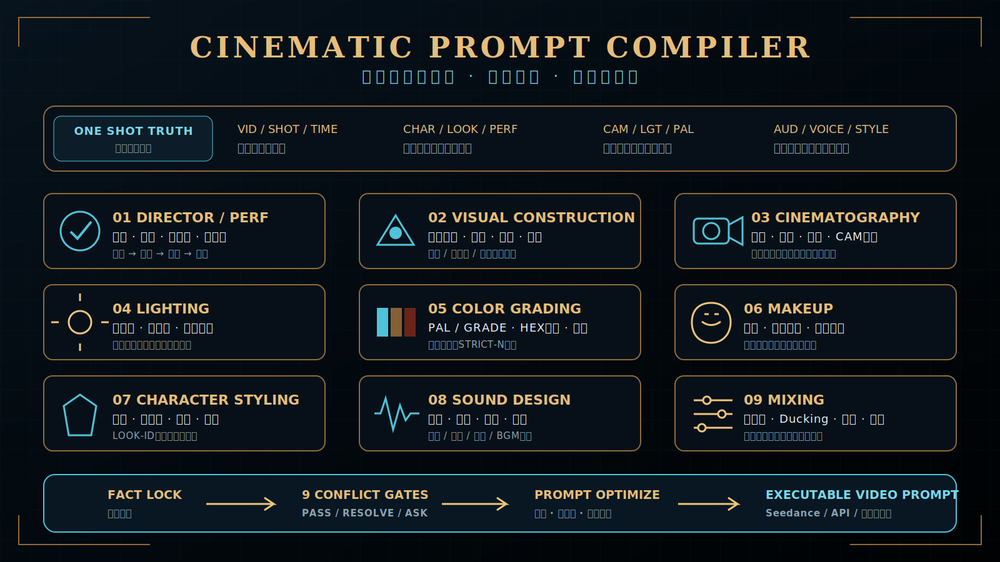
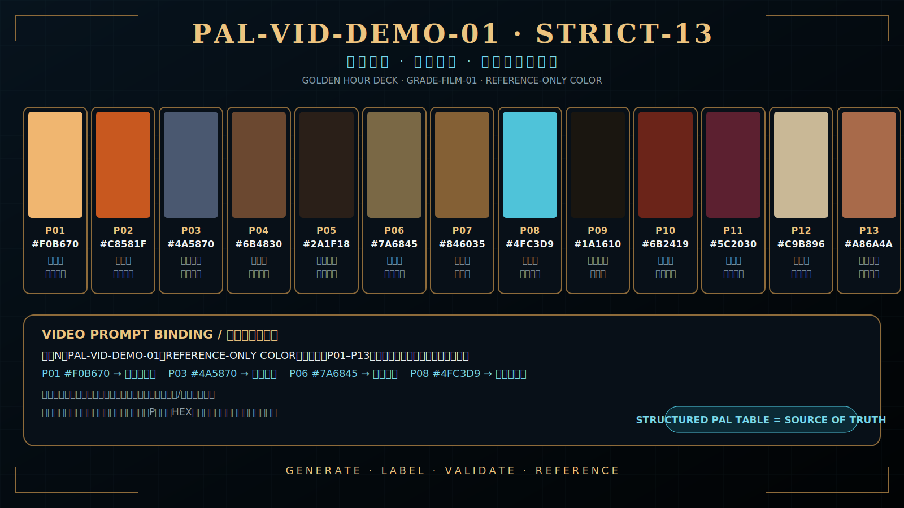
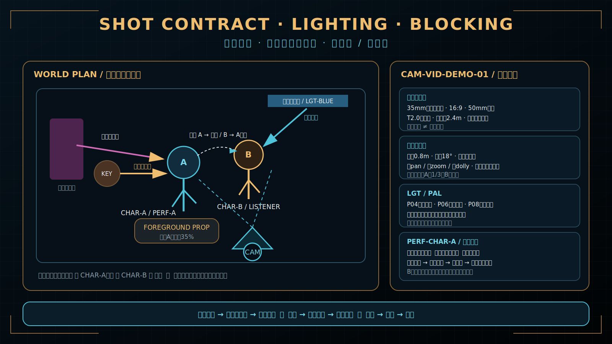
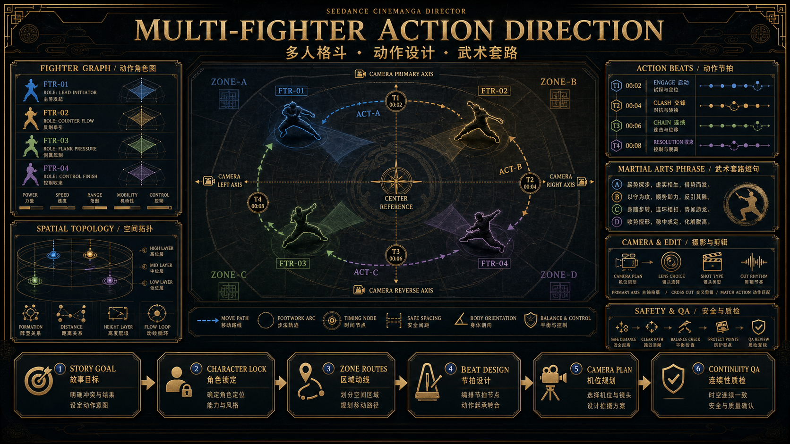

# Skill Architecture

<p align="center">
  
</p>

## 设计目标

本仓库采用“薄入口、强参考、可复用模板、可验证示例”的结构，使主 `SKILL.md` 保持清晰，同时允许后续扩展题材、镜头规则和输出格式。

## 分层

### 1. 入口层：`SKILL.md`

负责：

- 触发条件；
- 最高优先级规则；
- 双影视模式；
- 模式选择；
- 总体导演流程；
- 引用模板与规则库。

### 2. 输出层：`templates/`

- `single-15s.md`：完整15秒单条；
- `multi-clip.md`：连续多条4–15秒与尾帧合约；
- `storyboard-board.md`：以每条4–15秒视频为单位，灵活选择标准故事板、九宫格、二十五宫格或智能宫格；同时导出无标记CLEAN层与带路线REVIEW层，并以PANEL-ID支持单格视频执行。
- `revision-preview.md`：用户不满意时先展示唯一目标、诊断、新版完整提示词、锁定项和影响范围，等待编辑或批准后再定点生成。
- `multi-fighter-action.md`：多人冲突的动作角色图、空间拓扑、套路短句、逐拍动作、摄影与制作安全扩展。
- `cinematic-department-review.md`：九部门共享的STYLE/PAL/LOOK/PERF/LGT/AUD、摄影、空间、时间和冲突会审表。
- `color-palette-board.md`：结构化PAL源数据、确定性标注色卡、REFERENCE-ONLY COLOR素材绑定和视频色号引用。
- `compiled-video-prompt.md`：把已通过会审的当前VID压缩为生成端唯一视频提示词。

模板只定义成品结构，不承载所有解释性规则。

### 3. 规则层：`references/`

<p align="center">
  
</p>

- 连续性；
- 质量检查；
- 风格模式；
- 对白时长；
- 镜头语言；
- 自适应分镜形式与 Seedance 2.0 详细分镜图；
- 角色多视角设计与不同角色面部差异化；
- 3D影视级制作；
- 真人摄影与表演；
- 提示词编译与冲突消解。
- 稳定资产ID、修订版本、最小重生成单位和下游 `REVIEW_REQUIRED` 传播规则；
- 多人格斗、武术套路、动作物理、空间并发和影视特技安全边界；
- 九部门导演会审、世界/摄影机/屏幕坐标、风格作用域、色卡、妆造、声音混音和视频提示词编译合同；
- 23份按需导演参考知识库：工作流、镜头语言、运镜、剪辑、光影、接触风险、竖屏、提示词词典、场面调度、景深、构图、13字段大表、状态变化、高难度镜头、一镜到底与平台资料。

规则文件可独立迭代，避免主入口无限膨胀。`knowledge-00-index.md` 负责路由和优先级；`knowledge-01...22` 只提供参考，不升级为硬规则，也不得一次性全部加载。

### 4. 示例层：`examples/`

使用完全原创、无私人信息的样例验证：

- 输入如何表达；
- 单条模式如何输出；
- 多条模式如何建立尾帧接力。

### 5. 资产层：`assets/`

存放项目主视觉、架构图、技能总览、图标资产板，以及九宫格、二十五宫格、智能宫格、标准故事板、色卡、镜头合同和角色差异化等示例图片。仓库文档图只用于说明；实际视频生成以文字合同、角色板、用户或剧情选中的CLEAN单格及当前VID素材清单为依据。

### 6. 验证层：`scripts/` 与 `tests/`

- `validate_skill.py`：结构与关键字段静态校验；
- `acceptance-cases.md`：人工验收场景。

## 数据流

```text
用户素材
  ↓
剧情分析：事实、原台词、关系、节拍与时间预算
  ↓
必要人物过滤
  ↓
模式判断（单条 / 多条）
  ↓
锁定当前VID与4–15秒总时长 → 按节拍和复杂度选择分镜形式（标准 / 九宫格 / 二十五宫格 / 智能宫格）
  ↓
按镜头问题加载所需知识参考（不改变既定剧情与流程）
  ↓
高难度/一镜到底适用闸门（仅在相关任务触发；不通过则拆镜或降级）
  ↓
角色多视角设计与差异化锁定
  ↓
状态账本：身份 / 道具 / 空间 / 轴线 / 光影 / 尾帧
  ↓
多人动作导演（仅相关剧情）：FTR角色图 / ZONE与ACT路线 / 套路短句 / 行动令牌 / 安全边界
  ↓
镜头使用清单：USE / REFERENCE-ONLY / SKIP
  ↓
镜头合约与表演调度
  ↓
对白时长与九部门导演会审：导演/PERF / 视觉构造 / 摄影 / 光影 / 调色 / 化妆 / 妆造 / 声音 / 混音
  ↓
CAM / ACT / GAZE / FOCUS / LIGHT路线规划
  ↓
详细分镜双层：CLEAN纯画面 + 同构REVIEW路线标注；单VID、总时长≤15秒、逐镜起止时间/Δt与稳定PANEL-ID
  ↓
3D / 真人专项真实感校验
  ↓
连续性与尾帧校验
  ↓
按剧情推荐或用户指定选择PANEL-ID → REVIEW路线编译为自然语言 → 剔除制作标记
  ↓
会审后视频提示词编译：唯一STYLE LOCK / 摄影与PERF合同 / 光色妆造声音基线 / 变化时间轴
  ↓
执行素材清单：独立角色板 / 被选PANEL-ID-CLEAN / 场景板 / REFERENCE-ONLY COLOR色卡 / 尾帧
  ↓
API dry-run与可选生成
```

执行素材的独立身份绑定与过滤关系如下。此图用于解释角色板、场景、分镜页、运镜参考和音频参考如何进入执行清单，不替代文字合同。

<p align="center">
  
</p>

九部门共享事实、PERF表演合同与提示词编译关系见下图；它只解释架构，不作为运行时输入：



STRICT-13色卡的确定性标注与视频引用关系见下图：



镜头空间、人物站位、环境光/人物光和PERF合同的协同见：



多人动作模块把角色身份、空间路线、动作节拍、武术风格和摄影/安全边界收敛到同一执行图：

<p align="center">
  
</p>

## 与视觉资产的对应关系

- `cover-banner.png`：品牌封面；
- `skill-preview.png`：功能总览；
- `system-architecture.png`：流程架构图；
- `storyboard-example.png`：标准执行板示例；
- `nine-grid-example.png`：九宫格板式示例；
- `twenty-five-grid-example.png`：长序列板式示例；
- `adaptive-storyboard-workflow.png`：自适应分镜形式决策；
- `character-differentiation-board.png`：角色差异化说明（非运行时合并角色板）；
- `ai-readable-camera-routes.png`：AI可辨识运镜与动作路线语法；
- `segmented-camera-path.png`：多段运镜节点、逐段箭头与同步俯视/侧视路线；
- `knowledge-routing-map.png`：按任务选择参考知识、避免全量加载；
- `seedance-multimodal-binding.png`：独立角色板、分镜、场景、运镜与音频参考的执行绑定；
- `multi-fighter-action-system.png`：多人动作角色图、空间拓扑、套路节拍与安全边界；
- `cinematic-department-review-system.svg`：九部门共享事实、PERF表演与提示词编译；
- `color-palette-reference-example.svg`：STRICT-13结构化色卡与视频引用；
- `palette-neon-dressing-room-example.svg`：霓虹化妆间GUIDED-10、人物光和肤色保护色卡；
- `palette-palace-night-example.svg`：宫廷夜戏STRICT-10环境、烛光与人物/生物材质色卡；
- `palette-mojia-flight-example.svg`：云海机关飞行STRICT-12环境、材质、服装和道具色卡；
- `shot-contract-lighting-blocking-example.svg`：坐标、构图、站位、遮挡、光影和表演合同；
- `live-action-performance-example.png`：真人微表演、人物光、肤质和胶片响应；
- `3d-cinematic-performance-example.png`：3D眼神、重心、接触、材质与次级运动；
- `icons-board.png`：视觉语言与模块化图标资产板。
- `workflow-architecture.png`：十阶段工作流与仓库结构详图；
- `prompt-output-system.png`：单条、多条及尾帧交付结构；
- `visual-assets-qa.png`：视觉资产和质检门槛总览。

## 扩展约定

新增规则时：

- 通用硬规则放 `references/`；
- 外部方法资料放 `references/knowledge-*`，并在 `knowledge-00-index.md` 登记适用任务、优先级和时效边界；
- 新输出形态放 `templates/`；
- 可复现用例放 `examples/` 或 `tests/`；
- 主入口只增加导航和最高优先级原则；
- 不引入不必要的脚本依赖。
